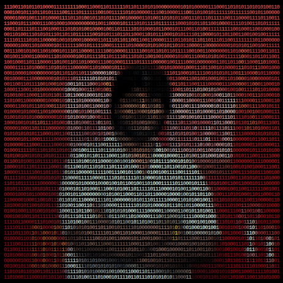

### Mani Kumar Kundurthi

**Data Scientist · Math Enthusiast**

- 🔭 Currently working on: dynamic pricing engine (segmentation → elasticity modeling → optimization)
- 🧠 Learning / exploring: ML self-study (math foundations → classical algorithms), fractional calculus
- 🛠️ Tech stack: Python · Python · AWS · Dataiku
- ✍️ Blog / writing: [Substack](https://substack.com/@manikumar950)
- 🌐 Portfolio: [pf.manikumar.space](https://pf.manikumar.space)
- 💼 LinkedIn: [in/codewithkmk](https://linkedin.com/in/codewithkmk)
- 📫 Reach me: kmk@manikumar.space

 
